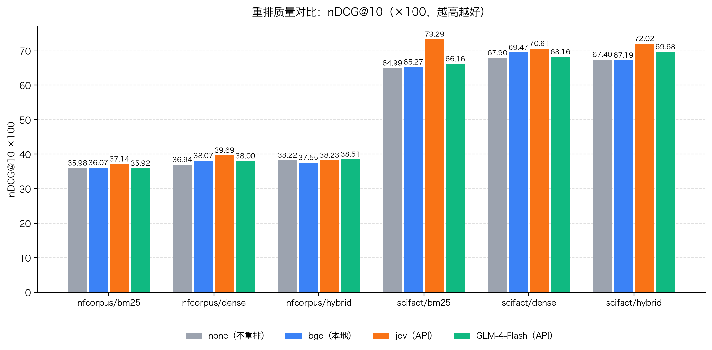

# Modular RAG MCP Server


**把你的私有文档变成 AI 助手随时可查的知识库**——在 Claude Desktop / Cursor / ZCode 里装上它，助手就能检索你的文档并给出带引用的回答。本地运行，数据不出你的电脑。

- 🙋 **适合谁**：想让 AI 助手查自己文档的人；想给团队搭一个共享知识库检索服务的人
- ⚡ **多快能用**：克隆 → 填 2 个免费 key → IDE 里贴一段配置，然后直接用对话传文档、问问题
- 🏆 **效果如何**：不是"能跑就行"——4 种重排方案在 BEIR 公开数据集上实测对比（见下表），质量 / 速度 / 成本 / 可靠性四维度全量化
- 🧪 **质量可证**：离线金标（hit@10 / MRR / nDCG@10）+ Ragas LLM-as-Judge 四指标，评测分数回写 Langfuse trace；CI 门禁低于阈值自动阻断合并

> 可插拔、可观测的模块化 RAG 检索服务，通过 **MCP（Model Context Protocol）** 把私有知识库暴露给任意 AI 助手——Copilot、Claude Desktop、ZCode 等开箱即用。
> 不止能跑：四种重排路线（none / BGE / **Jev** / LLM）在 BEIR 公开数据集上有完整的**质量 / 速度 / 成本 / 可靠性**四维实测。

## 📊 重排基准实测（BEIR，test split，100 条查询）

*nDCG@10 ×100，越高越好；`jev` 在 6 格中拿 5 个第一，scifact/bm25 上 +8.3。*

<table class="markdown-table">
  <tr><th>dataset/retriever</th><th>none</th><th>bge</th><th>jev</th><th>llm</th></tr>
  <tr><td>scifact/bm25</td><td>64.99</td><td>65.27</td><td>73.29</td><td>66.16</td></tr>
  <tr><td>scifact/dense</td><td>67.90</td><td>69.47</td><td>70.61</td><td>68.16</td></tr>
  <tr><td>scifact/hybrid</td><td>67.40</td><td>67.19</td><td>72.02</td><td>69.68</td></tr>
  <tr><td>nfcorpus/bm25</td><td>35.98</td><td>36.07</td><td>37.14</td><td>35.92</td></tr>
  <tr><td>nfcorpus/dense</td><td>36.94</td><td>38.07</td><td>39.69</td><td>38.00</td></tr>
  <tr><td>nfcorpus/hybrid</td><td>38.22</td><td>37.55</td><td>38.23</td><td>38.51</td></tr>
</table>



---

## ✨ 核心特性

- **混合检索**：BM25（稀疏）+ Dense Embedding（语义）双路召回，RRF 融合，兼顾专有名词与同义表达；
- **全链路可插拔**：LLM / Embedding / Reranker / VectorStore / Splitter / Evaluator 全部抽象接口 + 工厂 + `settings.yaml` 配置驱动，**改一行配置即换后端，零代码修改**；
- **重排可量化**：内置 BEIR 基准脚本，谁好谁坏跑一遍就知道（见下文实测）；
- **Typed-Judgment 重排（Jev）**：接入 TypeSafe System One 模型——不生成任何文字，直接输出类型化相关性评分 + 校准概率，**没有"JSON 解析失败"这条失败路径**；
- **双层可观测**：内置 JSONL trace + Streamlit 七页面 Dashboard（含 Query Playground 调试查询）；每次运行自动上报 Langfuse（OTLP），延迟 / token / 成本 / 每阶段瀑布开箱即见；
- **评测闭环 + CI 质量门禁**：离线金标（hit@10 / MRR / nDCG@10）+ 在线 Ragas LLM-as-Judge 四指标（faithfulness / relevancy / precision / recall），评测分数自动回写每条 trace；CI 中指标低于阈值自动阻断合并（本仓库即用此门禁）；
- **多模态检索**：文档图片经 Vision LLM 生成描述后入索引，"搜文字、出图片"；
- **MCP 双传输**：stdio（个人本地，IDE 一段配置即用）+ Streamable HTTP（团队/远程共享，连 URL 即用）。

## ⏱️ 速度与成本实测（同批查询）

| 重排器               | 延迟 p50 | $ / 千次查询   |
| ----------------- | ------ | ---------- |
| bge（本地 CPU）       | ~0.5s  | $0         |
| **jev（API）**      | ~1.5s  | **~$0.17** |
| GLM-4-Flash（聊天重排） | ~40s   | $0（免费档）    |
| deepseek-chat（折算） | ~40s   | ~$1.33     |

完整分析（含诚实边界与复现命令）见 [`reports/BENCHMARK_REPORT.md`](reports/BENCHMARK_REPORT.md)。

## 🚀 快速开始

> **先决条件**：Python ≥ 3.10；[Ollama](https://ollama.com)（本地 embedding，装好后 `ollama pull nomic-embed-text`）；API key（GLM 有免费档，Jev 可选）

### 1. 安装

```bash
git clone https://github.com/bloodfel/modular-rag-mcp.git
cd modular-rag-mcp
python -m venv .venv && source .venv/bin/activate
pip install -e ".[dev]"
```

### 2. 配置凭证

```bash
cp .env.example .env   # 填入你的 key，.env 已被 gitignore
```

| 环境变量               | 用途                           | 获取                                           |
| ------------------ | ---------------------------- | -------------------------------------------- |
| `GLM_API_KEY`      | LLM / Vision（glm-4-flash 免费） | [open.bigmodel.cn](https://open.bigmodel.cn) |
| `TYPESAFE_API_KEY` | Jev 重排                       | [typesafe.ai](https://api.typesafe.ai)       |
| `ZHIPUAI_API_KEY`  | 备用 GLM                       | 同上                                           |

Embedding 默认走本地 Ollama（`nomic-embed-text`），离线可用；也可在 `config/settings.yaml` 切换为云端。

### 3. 灌库 + 提问

```bash
python scripts/ingest.py data/sample_docs                    # 离线摄取
python scripts/query.py --query "Modular RAG 是什么？"       # 命令行直接问
```

### 4. 接入你的 AI 助手（MCP）

按你的场景二选一，接入后用法完全相同——直接在助手里说人话：
*"把这段文档加进知识库"*（→ `ingest_document`）、*"退货政策是什么？"*（→ `query_knowledge_hub`）。

**🙋 场景一：个人本地用（大多数用户，推荐）**——知识库在自己电脑上，数据不出本机。
在 ZCode / Claude Desktop / Cursor 的 MCP 配置里加一段 JSON，助手会自动拉起 server 进程
（**把两处 `/绝对路径` 替换为你克隆后的仓库路径**，如 `/Users/you/modular-rag-mcp`）：

```json
{
  "mcpServers": {
    "modular-rag": {
      "command": "/绝对路径/.venv/bin/python",
      "args": ["-m", "src.mcp_server.server"],
      "cwd": "/绝对路径/modular-rag-mcp"
    }
  }
}
```

**👥 场景二：团队 / 远程共享**——知识库集中在一台机器，使用者只连 URL、不用克隆仓库。
部署者先起服务：

```bash
python -m src.mcp_server.server --http --host 0.0.0.0 --port 8000
# MCP 端点: http://localhost:8000/mcp
```

```json
{
  "mcpServers": {
    "modular-rag": {
      "type": "streamable_http",
      "url": "http://your-host:8000/mcp"
    }
  }
}
```

三种部署姿势：

| 场景 | 做法 |
|---|---|
| 同一局域网 | `--host 0.0.0.0` 直接用内网 IP 连 |
| 临时公网演示 | `cloudflared tunnel --url http://localhost:8000` 一行获得公网 URL |
| 长期托管 | 一台 VPS 上常驻运行（systemd）；知识库数据始终在你掌控的机器上 |

> 公网部署请置于反向代理后并自行叠加鉴权（当前版本未内置认证）。

**上传知识库（三选一，按需）**：

- 直接在 agent 里让助手调 `ingest_document`（文本 / Markdown，同名自动替换旧版）
- PDF 等文件走管理台：`streamlit run src/observability/dashboard/app.py` → Ingestion 页拖拽上传、看进度
- 或命令行批量：`python scripts/ingest.py <目录>`

可用的工具：`ingest_document`（上传文本/Markdown）、`query_knowledge_hub`（混合检索 + 重排 + 引用）、`list_collections`、`get_document_summary`。

### 5. 可观测（可选）

```bash
streamlit run src/observability/dashboard/app.py   # 内置七页面 Dashboard（含 Query Playground）
docker compose -f infra/langfuse/docker-compose.yml up -d   # Langfuse 自托管 (localhost:3000)
python scripts/export_langfuse.py --last 10        # 把本地 trace 导入 Langfuse
```

## 🏗️ 架构

```
AI 助手 (Copilot / Claude / ZCode / 任意 MCP Client)
        │  JSON-RPC（stdio 或 streamable HTTP）
        ▼
┌─ MCP Server 层 ──────────────────────────────┐
│  query_knowledge_hub / list_collections / …  │
└──────────────┬───────────────────────────────┘
               ▼
┌─ Retrieval Pipeline ─────────────────────────┐
│ QueryProcessor → Dense + BM25 并行召回        │
│        → RRF 融合 → Rerank → 带引用响应        │
└──────────────┬───────────────────────────────┘
               ▼
┌─ Libs 可插拔层（Factory + settings.yaml）─────┐
│ LLM: azure/openai/ollama/deepseek/glm        │
│ Embedding: openai/azure/ollama               │
│ Reranker: none/cross_encoder/llm/jev         │
│ VectorStore: chroma    Splitter: recursive   │
└──────────────────────────────────────────────┘
```

| 目录                   | 内容                                                     |
| -------------------- | ------------------------------------------------------ |
| `src/libs/`          | 可插拔 provider（LLM / Embedding / Reranker / VectorStore） |
| `src/core/`          | 摄取与检索流水线、查询编排、配置                                       |
| `src/mcp_server/`    | MCP Server 与工具层                                        |
| `src/observability/` | TraceContext、指标库、Dashboard、评估                          |
| `scripts/`           | ingest / query / 基准跑批 / BEIR 灌库 / Langfuse 导出          |
| `reports/`           | 基准报告与图表                                                |
| `docs/specs/`        | 子功能设计文档（含进度跟踪表）                                        |

## ⚙️ 换后端 = 改一行配置

```yaml
# config/settings.yaml —— 把重排换成 Jev：
rerank:
  enabled: true
  provider: "jev"          # none | cross_encoder | llm | jev
  model: "jev-1.13.0"
  min_score: 1.0           # 可选质量门阈值
```

凭证一律走 `.env` + `${ENV_VAR}` 占位符，不进代码库。

## 🧪 测试与基准复现

```bash
pytest -q                                   # 1200+ 测试
pip install -e ".[bench]"
python scripts/prepare_beir.py --datasets scifact nfcorpus   # ~10 min 灌库
python scripts/benchmark_rerank.py --datasets scifact nfcorpus --num-queries 50
python scripts/make_charts.py reports/rerank_benchmark_<date>.json   # 重画图表
```

## 📚 文档

- [`DEV_SPEC.md`](DEV_SPEC.md) — 架构宪法与阶段排期（A–K 共 76 个任务，全部完成）
- [`docs/RESULTS.md`](docs/RESULTS.md) — 产出数据总账：可观测 / 检索基线 / Ragas 四指标 / 工程实验
- [`docs/CONFIG_GUIDE.md`](docs/CONFIG_GUIDE.md) — settings.yaml 逐项配置教程 + 常见配方（或在 AI 助手里说一句 "setup" 自动配置）
- [`docs/specs/`](docs/specs/) — 子功能设计文档（Jev 基准 / Langfuse MVP，含可复跑 Runbook）
- [`reports/BENCHMARK_REPORT.md`](reports/BENCHMARK_REPORT.md) — 基准详细分析

## 🗺️ Roadmap

- [x] 评测闭环：离线金标（hit@10 / MRR / nDCG@10）+ Ragas 四指标 + 分数回写 Langfuse trace
- [x] CI 质量门禁：每次变更自动重跑检索评测，低于阈值阻断合并（`scripts/quality_gate.py`）
- [x] min_score 质量门实验：三档实测（4.0 档 24% 空结果 → 默认改 1.0）
- [x] Langfuse 实时上报：trace 收集即自动上报（OTLP，无需开关）
- [ ] fiqa 数据集（5.7 万篇）全量对比
- [ ] BGE + Jev 双信号融合实验
- [ ] HTTP 模式叠加鉴权（Bearer token）
- [ ] `ingest_document` 支持 PDF / 图片上传（base64 传输，图片走 Vision 描述后入索引）
- [ ] 发布 PyPI 包（`uvx modular-rag-mcp` 一键安装，免克隆）
- [ ] MCP 工具链路实时上报（当前 MCP 查询仍用批量导出）

---

*基于 Python 3.10+ / MCP 官方 SDK / Chroma / Streamlit 构建。*
