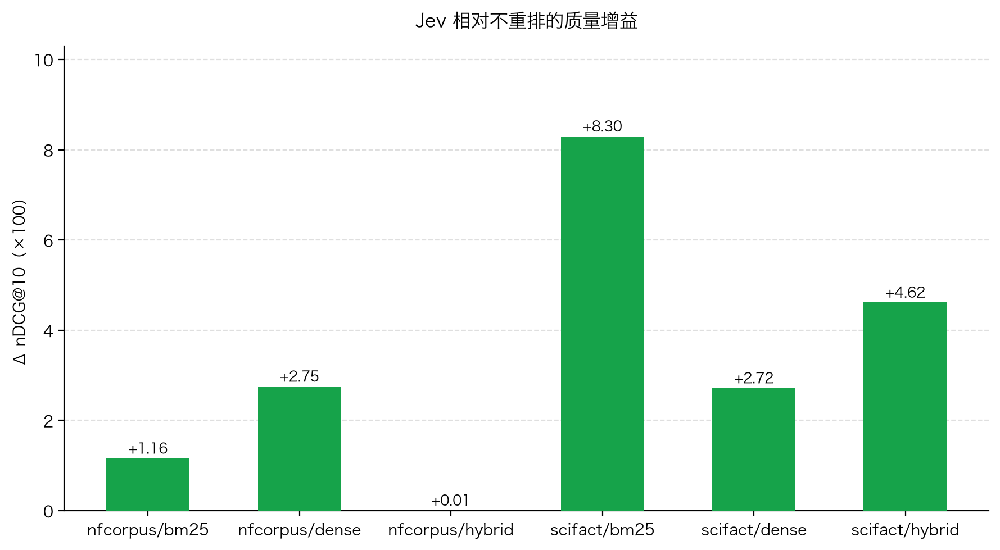
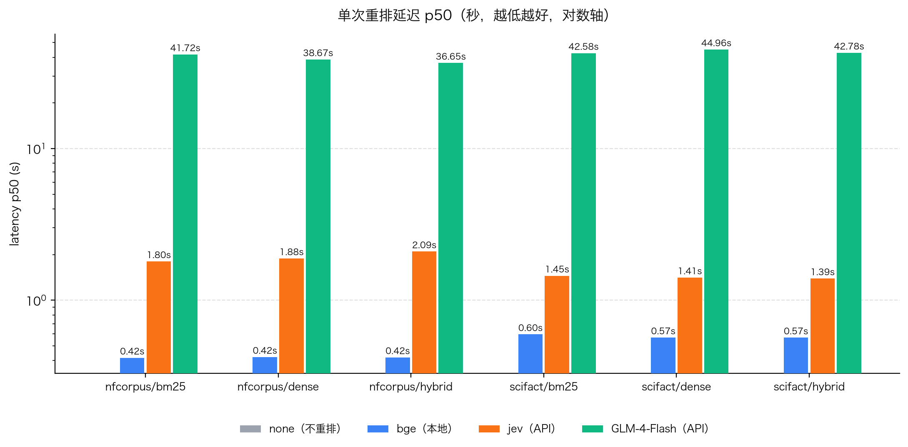

# Jev × RAG：用"不打字的模型"做重排序，40 分钟基准实测

> **TL;DR**：我们把 TypeSafe 的 System One 模型 **Jev** 接入可插拔 RAG 框架的重排插槽——
> 它不生成任何文字，只输出**类型化的相关性评分 + 校准概率**。在 BEIR 两个公开数据集、
> 100 条 test split 查询、4 种重排器的同场对比中，**Jev 在 6 格中的 5 格拿下质量第一**
> （scifact 上最多 **+8.3 nDCG@10**），单次重排延迟 ~1.5 秒，成本 **~$0.17 / 千次查询**。


---

## 1. 为什么是 Jev

传统重排有三条路：交叉编码器（BGE，本地快但语义浅）、LLM 重排（让 GPT 类模型输出
JSON 分数——**脆**：要剥 markdown、容错解析、幻觉 ID 静默丢候选、分数无校准含义）、
以及专门的排序 API。

Jev 属"System One"类模型：**不写一个字，只回答结构化问题**。一次调用并行给出全部
候选的有序档位评分、完整概率分布和置信度。接口保证 schema，不存在"格式解析失败"
这条失败路径——分数自带校准含义，可以直接设阈值做质量门。

这正是我们想要的重排原语：**重排是一个决策，不是一段话。**

## 2. 实验设计

| 维度 | 设定 |
|---|---|
| 数据集 | BEIR `scifact`（5,183 篇）+ `nfcorpus`（3,633 篇），全部灌入项目自有向量库 + BM25 索引 |
| 查询 | 每数据集从 **test split** 固定抽样 50 条（seed=42），ground truth 用 BEIR 官方 qrels |
| 检索路径 | bm25 / dense（nomic-embed-text 本地向量）/ hybrid（两者 RRF 融合，k=60） |
| 候选深度 | top-10（Jev 单次调用 ≤10 问题的硬约束，四列一致保证公平） |
| 对比重排器 | `none`（不重排）/ **BGE**（bge-reranker-base 本地交叉编码器）/ **Jev**（jev-1.13.0）/ **GLM-4-Flash**（聊天模型 pointwise 打分） |
| 指标 | nDCG@10（主）/ MRR@10 / Hit@10 + 延迟 p50/p95 + 估算成本 + 失败回退率 |
| 运行方式 | 6 线程查询级并发，限流指数退避；全程真实 API，无 mock |

评测完全确定性：分数由 BEIR 人工标注金标决定，**评测环节没有任何 LLM 参与**。

## 3. 结果

### 3.1 质量：nDCG@10（×100，越高越好）

| dataset/retriever | none | bge | **jev** | llm |
|---|---|---|---|---|
| scifact/bm25 | 64.99 | 65.27 | **73.29** | 66.16 |
| scifact/dense | 67.90 | 69.47 | **70.61** | 68.16 |
| scifact/hybrid | 67.40 | 67.19 | **72.02** | 69.68 |
| nfcorpus/bm25 | 35.98 | 36.07 | **37.14** | 35.92 |
| nfcorpus/dense | 36.94 | 38.07 | **39.69** | 38.00 |
| nfcorpus/hybrid | 38.22 | 37.55 | 38.23 | 38.51 |

**Jev 在 6 格中拿 5 个第一。** 亮点：

- `scifact/bm25`：+8.3 分（64.99 → 73.29），MRR 从 61.93 拉到 **74.45**——首位相关文档的大幅前移；
- `scifact/hybrid`：+4.6 分——即便经过 RRF 融合，Jev 仍有可观的二次精排空间；
- `nfcorpus` 提升较小（+0.3 ~ +2.8）：该数据集查询短、语料主题密集，召回列表本身同质化严重。

### 3.2 质量提升幅度（Jev − none）



### 3.3 速度：单次重排延迟 p50（秒，越低越好）



| 重排器 | p50 | 相对 |
|---|---|---|
| bge（本地） | ~0.5s | 最快 |
| **jev（API）** | **~1.5s** | 可接受 |
| llm（GLM 聊天） | ~40s | 慢 25 倍 |

为什么 bge 最快：它是**本地**交叉编码器，10 个 (query, passage) 对一次批量前向就打完分，
无网络往返、无边际成本——这也是生产环境主流选择本地 rerank 的原因（重排在查询热路径上，
要求低延迟、高 QPS，且数据不出域）。Jev 慢在 API 网络往返（~1.5s），但一次调用**并行**
给全部候选打分；聊天模型重排慢在"生成"——要逐字写出一段 JSON（~40s），网络延迟 × 生成长度双重开销。

### 3.4 成本（每千次查询，实测 token 折算）

单次重排（10 候选）实测用量：Jev ~4k input tokens（output 免费）；GLM-4-Flash
~3.7k input + ~0.7k output（6 组合 × 5 查询实测均值）。按各家牌价折算：

| 重排器 | 计费方式 | $ / 千次查询 |
|---|---|---|
| bge（本地 CPU） | 边际成本 $0 | **$0** |
| glm-4-flash | 免费档 | **$0**（但慢 25 倍） |
| **jev-1.13.0** | $0.042/MTok input，output 免费 | **~$0.17** |
| deepseek-chat（折算） | $0.28/MTok in + $0.42/MTok out | ~$1.33（同样慢 ~40s） |

结论：Jev 的单位成本约为生成式 LLM 重排的 **1/8**，速度 **25 倍**。真正免费的选项是
本地 bge——代价是自己维护推理环境（本项目 bge 在 Apple Silicon CPU 上仍有 torch 并发
崩溃问题，被迫串行）。在线 API rerank（Cohere ~$2/千次）普遍比 Jev 贵一个数量级。

### 3.5 可靠性

600 次真实 API 重排调用中，Jev 仅 1 次失败回退（网络瞬态），**零格式解析失败**——
对照组 GLM 重排的 JSON 解析路径则需要剥 markdown、逐字段校验、幻觉 ID 过滤三层防御。
这正是我们引入 Jev 的核心动机。

## 4. 诚实的边界

- **小样本**：每格 50 条查询，2 分以内差异在噪声范围内；本表适合看**相对名次与量级**，不是论文级统计；
- **深度天花板**：只在 top-10 内重排——召回阶段把相关文档排到 10 名以外时，任何重排器都无法挽救；
- **公开数据集训练污染**：scifact/nfcorpus 是公开数据集，各家模型训练都可能见过它；列间相对比较不受影响，绝对值外推需谨慎；
- **GLM 列的归因**：glm-4-flash 是免费轻量模型 + pointwise JSON 打分非其强项，它列的落后应归因为"该模型不适合此用法"，而非"LLM 重排路线不行"；
- BEIR 语料超 5000 字符截断（影响 <0.25% 文档）。

## 5. 工程接入（全部走既有可插拔插槽）

```
src/libs/reranker/
├── base_reranker.py        # 既有抽象接口（零改动）
├── reranker_factory.py     # 注册 "jev" provider（+3 行）
├── llm_reranker.py         # 旧路线：聊天 JSON + 三层解析防御
└── jev_reranker.py         # 新路线：httpx 直连 System One，typed Score
```

- 配置切换：`settings.yaml` 里 `rerank.provider: "jev"`，凭证走 `.env`（`TYPESAFE_API_KEY`）
- 失败语义：网络/超时抛 `JevRerankError` → 上层既有 fallback 兜底；**无格式失败路径**
- 单测 mock 全覆盖（排序/阈值过滤/缺答案抛错/超 10 候选拒绝/用量记录），106 个 reranker 相关测试通过
- trace 自动接入：重排阶段耗时、token 用量、回退标记进入既有观测管道，Dashboard 与
  Langfuse 导出器直接复用

## 6. 复现

```bash
pip install -e ".[bench]"                       # 基准依赖
.venv/bin/python scripts/prepare_beir.py --datasets scifact nfcorpus   # 灌库 (~10 min)
export TYPESAFE_API_KEY=...                     # typesafe.ai 申请
.venv/bin/python scripts/benchmark_rerank.py --datasets scifact nfcorpus --num-queries 50
# → reports/rerank_benchmark_<date>.md + .json
```

## 7. Roadmap

- [ ] min_score 质量门实验：阈值 4.0 过滤在本基准中过于激进（存活候选 0-2 条反伤召回），
      正确用法是配合"证据充分性"判断做查询级放行——见设计文档 §4.2
- [ ] fiqa 数据集（5.7 万篇）全量对比
- [ ] BGE + Jev 双信号融合实验（TypeSafe 官方结论：无增益，待我们数据复现）
- [ ] Langfuse 实时链路上报（MVP 导出器已完成，见 `docs/specs/2026-09-21-langfuse-mvp-design.md`）

---

*数据文件：[`reports/rerank_benchmark_2026-09-22.json`](rerank_benchmark_2026-09-22.json)（逐 query 原始值）·
生成于 2026-09-22 · seed=42 可完全复现*
